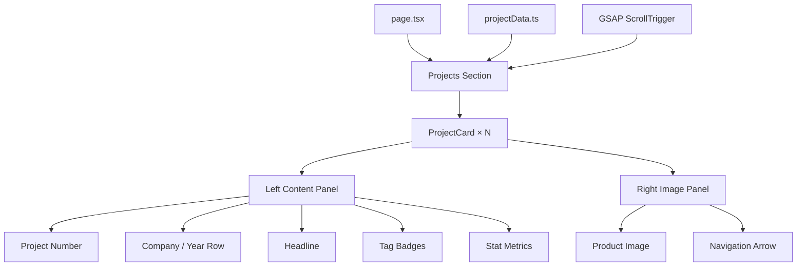

# Design Document: Project Card Redesign

## Overview

This design transforms the current simple project list in `src/components/projects.tsx` into a modern, full-width horizontal split card layout. Each card features a left content panel (project metadata, headline, tags, stats) and a right image panel (large product screenshot with colored background). The redesign leverages the existing GSAP + `@gsap/react` setup for scroll-triggered entrance animations and maintains full responsiveness across mobile, tablet, and desktop viewports.

### Key Design Decisions

1. **Extended data model with validation**: The `Project` interface is extended with new fields (`number`, `company`, `year`, `headline`, `tags`, `stats`, `bgColor`). A runtime validation utility ensures data integrity.
2. **Single component with conditional rendering**: Rather than splitting into many sub-components, the card uses a single `ProjectCard` component with inline conditional rendering for tags/stats visibility and anchor/div wrapper selection.
3. **GSAP ScrollTrigger for entrance animations**: Follows the existing `useGSAP` pattern from `hero.tsx` with scroll-triggered fade-in + slide-up animations.
4. **Tailwind-first responsive design**: Uses Tailwind's responsive prefixes (`md:`, `lg:`) for layout shifts rather than JavaScript-based breakpoint detection.

## Architecture



### Data Flow

```mermaid
flowchart LR
    A[projectData.ts] -->|ExtendedProject[]| B[Projects Component]
    B -->|Single project + index| C[ProjectCard]
    C -->|Conditional| D{Has URL?}
    D -->|Yes| E[Anchor Wrapper]
    D -->|No| F[Article Wrapper]
```

## Components and Interfaces

### Component Hierarchy

| Component     | File                              | Responsibility                                                        |
| ------------- | --------------------------------- | --------------------------------------------------------------------- |
| `Projects`    | `src/components/projects.tsx`     | Section wrapper, GSAP ScrollTrigger setup, renders card list          |
| `ProjectCard` | `src/components/project-card.tsx` | Individual card with split layout, hover effects, conditional wrapper |

### Projects Component (Refactored)

The existing `Projects` component is refactored to:

- Remove the hover-preview floating image logic
- Use `useGSAP` with `ScrollTrigger` for staggered entrance animations
- Render `ProjectCard` components in a vertical stack with 32px+ gap

```typescript
interface ProjectsProps {
  // No props needed - reads from projectData directly
}
```

### ProjectCard Component

```typescript
interface ProjectCardProps {
  project: ExtendedProject;
  index: number;
}
```

**Rendering logic:**

- If `project.url` exists → wrap in `<a>` with `target="_blank"` and `rel="noopener noreferrer"`
- If no `url` → wrap in `<article>`
- Left panel: project number, company/year, headline, tags (max 5), stats (max 4)
- Right panel: image with bgColor background, navigation arrow overlay

### TagBadge (Inline element, not separate component)

Rendered inline within ProjectCard as a styled `<span>`:

- Uppercase text, 12px font, 12px horizontal / 4px vertical padding, 1px solid border

### StatMetric (Inline element, not separate component)

Rendered inline within ProjectCard as a `<div>` column:

- Value: bold, 24px+ font
- Label: normal weight, 12px font

## Data Models

### Extended Project Interface

```typescript
// src/data/projectData.ts

interface ProjectStat {
  value: string; // max 20 characters, e.g. "+22%"
  label: string; // max 50 characters, e.g. "Trial-to-paid conversion uplift"
}

interface ExtendedProject {
  // Existing fields (preserved)
  id: number;
  title: string;
  description: string;
  image: string;
  url?: string;

  // New fields
  number: string; // Two-digit zero-padded, e.g. "01"
  company: string; // Max 100 characters
  year: string; // Format: "YYYY" or "YYYY - YYYY"
  headline: string; // Max 150 characters
  tags: string[]; // 1-10 items, each max 30 characters
  stats: ProjectStat[]; // 1-6 items
  bgColor?: string; // Valid CSS color value
}
```

### Validation Utility

```typescript
// src/lib/project-validation.ts

interface ValidationResult {
  valid: boolean;
  errors: string[];
}

function validateProjectNumber(number: string): boolean;
function validateYear(year: string): boolean;
function validateProject(project: ExtendedProject): ValidationResult;
```

**Validation rules:**

- `number`: matches `/^\d{2}$/`
- `company`: length <= 100
- `year`: matches `/^\d{4}(\s-\s\d{4})?$/`
- `headline`: length <= 150
- `tags`: array length 1-10, each item length <= 30
- `stats`: array length 1-6, each `value` <= 20, each `label` <= 50
- `bgColor`: optional, if present must be a valid CSS color string

### Sample Updated Project Data

```typescript
const projectData: ExtendedProject[] = [
  {
    id: 1,
    number: "01",
    company: "Movvie",
    year: "2024",
    title: "Movvie",
    headline: "Building a comprehensive movie discovery platform",
    description:
      "A movie database website, similar to IMDB, for finding film information.",
    image: "/images/movvie.png",
    url: "https://movvie-jade.vercel.app/",
    tags: ["WEB APP", "API", "REACT"],
    stats: [
      { value: "10K+", label: "Movies indexed" },
      { value: "< 1s", label: "Search response time" },
    ],
    bgColor: "#1a1a2e",
  },
  // ... more projects
];
```

## Correctness Properties

_A property is a characteristic or behavior that should hold true across all valid executions of a system — essentially, a formal statement about what the system should do. Properties serve as the bridge between human-readable specifications and machine-verifiable correctness guarantees._

### Property 1: Project number format validation

_For any_ string used as a project number, the validation function SHALL accept it if and only if it is exactly two decimal digits (matching `/^\d{2}$/`).

**Validates: Requirements 1.1**

### Property 2: String field length constraints

_For any_ ExtendedProject object, the `company` field SHALL be accepted if and only if its length is <= 100 characters, and the `headline` field SHALL be accepted if and only if its length is <= 150 characters.

**Validates: Requirements 1.2, 1.4**

### Property 3: Year format validation

_For any_ string used as a project year, the validation function SHALL accept it if and only if it matches the format "YYYY" (four digits) or "YYYY - YYYY" (two four-digit years separated by " - ").

**Validates: Requirements 1.3**

### Property 4: Tags array constraint validation

_For any_ array used as project tags, the validation function SHALL accept it if and only if the array has between 1 and 10 items (inclusive) and every item has length <= 30 characters.

**Validates: Requirements 1.5**

### Property 5: Stats array constraint validation

_For any_ array used as project stats, the validation function SHALL accept it if and only if the array has between 1 and 6 items (inclusive), every item's `value` has length <= 20 characters, and every item's `label` has length <= 50 characters.

**Validates: Requirements 1.6**

### Property 6: Tag display limit

_For any_ ExtendedProject with N tags (where 1 <= N <= 10), the rendered ProjectCard SHALL display exactly min(N, 5) tag badges.

**Validates: Requirements 3.5**

### Property 7: Stat display limit

_For any_ ExtendedProject with N stats (where 1 <= N <= 6), the rendered ProjectCard SHALL display exactly min(N, 4) stat metrics.

**Validates: Requirements 3.6**

### Property 8: Wrapper element determined by URL presence

_For any_ ExtendedProject, if the `url` field is defined and non-empty, the card wrapper SHALL be an anchor element (`<a>`) with `target="_blank"` and `rel="noopener noreferrer"`; if `url` is undefined or empty, the wrapper SHALL be a non-interactive element (`<article>`).

**Validates: Requirements 5.1, 5.5, 5.6**

### Property 9: Alt text correctness

_For any_ ExtendedProject, the image alt text SHALL contain the project title and SHALL have a total length of at most 125 characters.

**Validates: Requirements 8.3**

## Error Handling

### Image Load Failure

- The `ProjectCard` uses Next.js `Image` component with an `onError` handler
- On error, the image is replaced with a placeholder `<div>` that:
  - Maintains the same dimensions as the image area
  - Displays a neutral background color (`bg-muted`)
  - Shows a subtle icon (from lucide-react, e.g. `ImageOff`) centered
- The card remains fully functional (clickable if URL exists)

### Missing Optional Fields

| Field           | Fallback Behavior                          |
| --------------- | ------------------------------------------ |
| `bgColor`       | Transparent background on image area       |
| `url`           | Card renders as `<article>`, no navigation |
| `tags` (empty)  | Tag area hidden, no space reserved         |
| `stats` (empty) | Stats area hidden, no space reserved       |

### Data Validation Errors

- Validation runs at build time (or in development) via the validation utility
- Invalid data logs a console warning in development but does not crash the component
- The component renders with whatever data is available, gracefully truncating overlong strings

## Testing Strategy

### Unit Tests (Example-Based)

Focus on specific rendering scenarios:

1. **DOM structure**: Verify correct element ordering (number → company/year → headline → tags → stats)
2. **Responsive classes**: Verify correct Tailwind responsive classes are applied
3. **Styling**: Verify font classes, padding, border-radius, gap values
4. **Hover states**: Verify transition classes exist on card and arrow elements
5. **Keyboard accessibility**: Verify tabIndex, focus-visible outline, Enter key handler
6. **Image error state**: Verify placeholder renders when image fails to load
7. **Empty tags/stats**: Verify areas are hidden when arrays are empty

### Property-Based Tests

Using a property-based testing library (e.g., `fast-check`) with minimum 100 iterations per property:

1. **Validation properties (Properties 1-5)**: Test the validation utility with randomly generated inputs
2. **Rendering limit properties (Properties 6-7)**: Generate project data with varying tag/stat counts and verify display limits
3. **Wrapper selection property (Property 8)**: Generate projects with/without URLs and verify correct wrapper element
4. **Alt text property (Property 9)**: Generate projects with various title/description lengths and verify alt text constraints

**Test Configuration:**

- Library: `fast-check` (TypeScript-native, works well with Next.js/Jest/Vitest)
- Minimum iterations: 100 per property
- Tag format: `Feature: project-card-redesign, Property {N}: {title}`

### Integration Tests

1. **GSAP ScrollTrigger setup**: Verify ScrollTrigger is registered and configured with correct thresholds (start: "top 80%"), stagger (0.15s), and `once: true`
2. **Initial animation state**: Verify cards start with `opacity: 0` and `translateY: 50px`

### Manual Testing

- WCAG 2.1 AA color contrast verification (4.5:1 normal text, 3:1 large text)
- Screen reader testing for card navigation flow
- Visual regression across breakpoints (mobile < 768px, tablet 768-1024px, desktop > 1024px)
